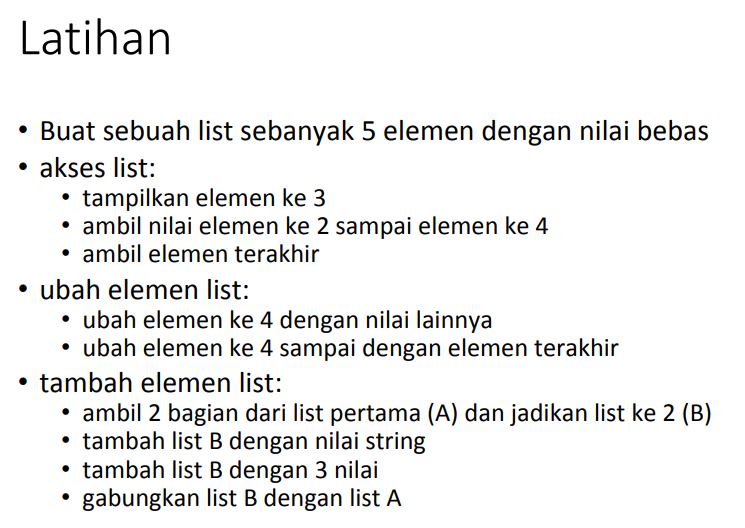
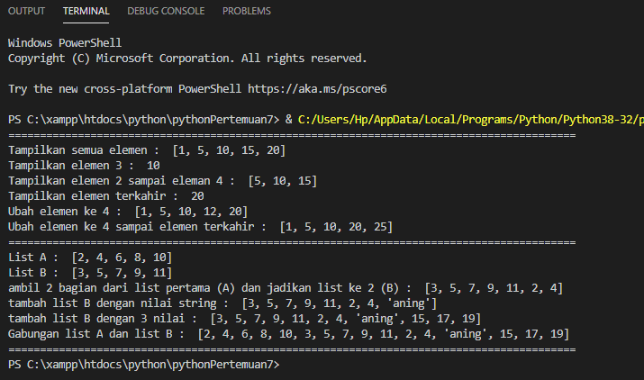
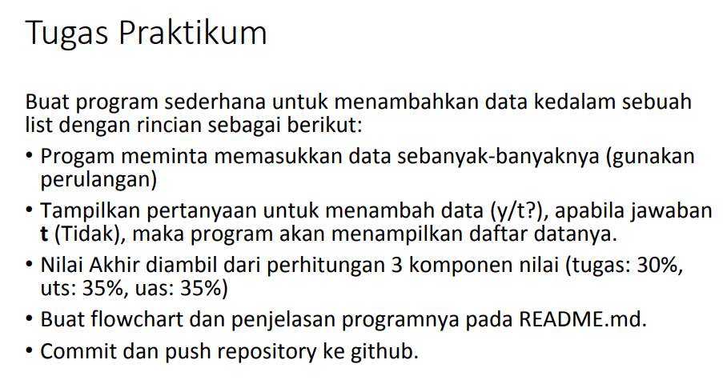
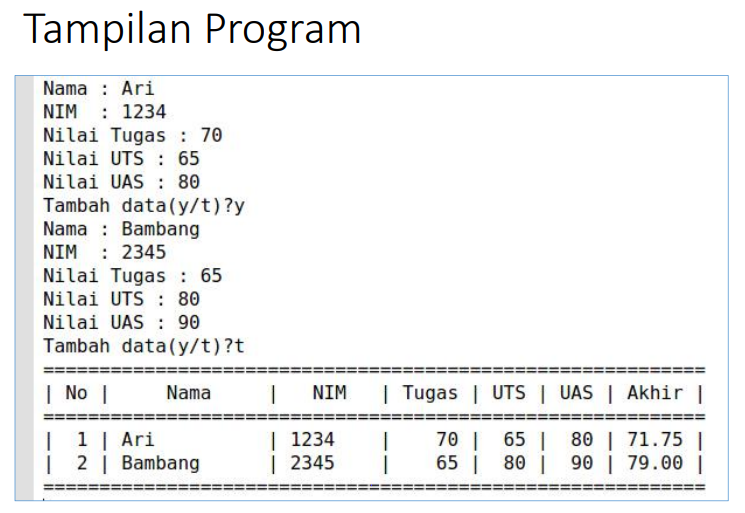
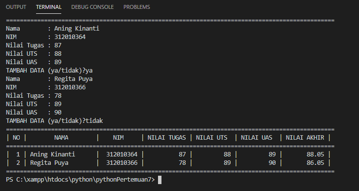
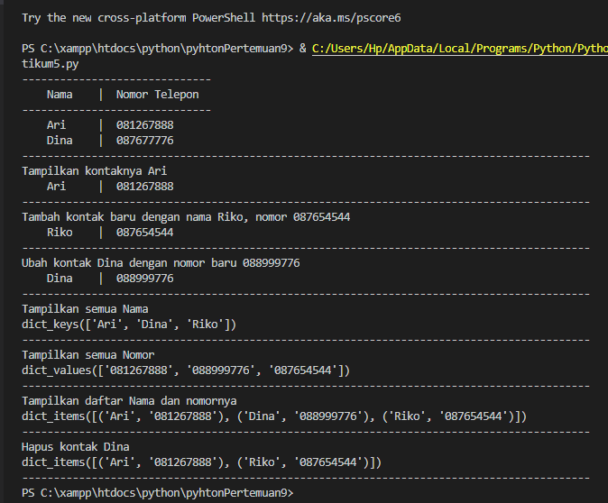

# TUGAS PERTEMUAN 9 DAN PENJELASAN
## LIST, TUPLE, DAN DICTIONARY

**Nama	  : Aning Kinanti** <br>
**Nim	    : 312010364** <br>
**Kelas	  : TI.20.A2** <br>
**Matkul	: Bahasa Pemrograman** <br>


## TUGAS LATIHAN PADA PRAKTIKUM 4

#### SOAL


#### SYNTAX
berikut merupakan syntax untuk menampilkan program diatas

```python
#author aning kinanti

print(90*"=")

angka = [1, 5, 10, 15, 20]

print("Tampilkan semua elemen : ", angka) #print semua elemen

print("Tampilkan elemen 3 : ", angka[2]) #print elemen 3

print("Tampilkan elemen 2 sampai eleman 4 : ", angka[1:4]) #print elemen 2 sampai elemen 4

print("Tampilkan elemen terkahir : ", angka[4]) #print elemen terkahir/elemen ke 5

angka[3] = 12
print("Ubah elemen ke 4 : ", angka) #ubah elemen ke 4 dengan nilai lain

angka[3:5] = [20, 25]
print("Ubah elemen ke 4 sampai elemen terkahir : ", angka) #ubah elemen ke 4 sampai terkahir

print(90*"=")

listA = [2, 4, 6, 8, 10] #buat 2 variabel, list A dan list B
listB = [3, 5, 7, 9, 11] 

print("List A : ", listA)
print("List B : ", listB) #Tampilkan semua list

listB.extend(listA[0:2])
print("ambil 2 bagian dari list pertama (A) dan jadikan list ke 2 (B) : ", listB) #ambil 2 bagian dari list pertama (A) dan jadikan list ke 2 (B)

listB.append("aning")
print("tambah list B dengan nilai string : ", listB) #tambah list B dengan nilai string

listB.extend([15, 17, 19])
print("tambah list B dengan 3 nilai : ", listB) #tambah list B dengan 3 nilai

listC = listA + listB
print("Gabungan list A dan list B : ", listC) #gabungkan list B dengan list A

print(90*"=")
```

#### OUTPUT
Dibawah ini merupakan hasil output dari syntax diatas



#### ANALISIS
•	Penjelasan singkat fungsi source sudah tertera pada comment disyntax.

## TUGAS PRAKTIKUM 4

#### SOAL




#### SYNTAX
berikut merupakan syntax untuk menampilkan program diatas

```python
#author aning kinanti - 312010364

print(95*"=")
print("MASUKAN DATA SISWA")
print(95*"=")

dataNilai = []
while True :
    nama = input("Nama        : ")
    nim = input("NIM         : ")
    nTugas = int(input("Nilai Tugas : "))
    nUts = int(input("Nilai UTS   : "))
    nUas = int(input("Nilai UAS   : "))
    nAkhir = float(nTugas)*30/100+(nUts)*35/100+(nUas)*35/100
    dataNilai.append ([nama, nim, nTugas, nUts, nUas, nAkhir])
    add = input("TAMBAH DATA (ya/tidak)?")

    if add.lower() == "tidak":
        break


#directory data siswa
print(95*"=")
print("| {0:^2} | {1:^18} | {2:^10} | {3:^10} | {4:^10} | {5:^10} | {6:^7} |".format("NO", "NAMA", "NIM", "NILAI TUGAS", "NILAI UTS", "NILAI UAS", "NILAI AKHIR"))
print(95*"=")
no = 0
for x in dataNilai:
    no+=1
    print("| {0:>2} | {1:<18} | {2:>10} | {3:>11} | {4:>10} | {5:>10} | {6:>11.2f} |"\
        .format (no,x[0][:18],x[1][:10],x[2],x[3],x[4],x[5]))
print(95*"=")
```

#### OUTPUT
Dibawah ini merupakan hasil output dari syntax diatas



#### ANALISIS
•	Proses input data terjadi pada syntax dibawah ini :
``` pyhton
dataNilai = []
while True :
    nama = input("Nama        : ")
    nim = input("NIM         : ")
    nTugas = int(input("Nilai Tugas : "))
    nUts = int(input("Nilai UTS   : "))
    nUas = int(input("Nilai UAS   : "))
    nAkhir = float(nTugas)*30/100+(nUts)*35/100+(nUas)*35/100
    dataNilai.append ([nama, nim, nTugas, nUts, nUas, nAkhir])
    add = input("TAMBAH DATA (ya/tidak)?")
```

•	Pada statement `dataNilai=[]` berfungsi untuk menyimpan/merangkap data yang akan diinputkan oleh user <br>
•	Pada statement `while True :` berfungsi untuk melakukan proses looping/perulangan. <br>
•	Pada statement `nAkhir = float(nTugas)*30/100+(nUts)*35/100+(nUas)*35/100` diambil dari ketentuan soal untuk proses perhitungan nilai akhir. <br>
•	Pada statement `dataNilai.append ([nama, nim, nTugas, nUts, nUas, nAkhir])` berfungsi menambah element list. <br>
•	Pada statement
``` python
add = input("TAMBAH DATA (ya/tidak)?")

if add.lower() == "tidak":
        break
```
  untuk melakukan proses condition atau pemilihan 2 opsi <br>
  jika user memilih ya maka program akan menampilkan tambah data, sedangkan jika user memilih tidak maka program akan menampilkan directory data mahasiswa. <br>
  
•	Proses directory terjadi pada syntax dibawah ini :
``` pyhton
#directory data siswa
print(95*"=")
print("| {0:^2} | {1:^18} | {2:^10} | {3:^10} | {4:^10} | {5:^10} | {6:^7} |".format("NO", "NAMA", "NIM", "NILAI TUGAS", "NILAI UTS", "NILAI UAS", "NILAI AKHIR"))
print(95*"=")
no = 0
for x in dataNilai:
    no+=1
    print("| {0:>2} | {1:<18} | {2:>10} | {3:>11} | {4:>10} | {5:>10} | {6:>11.2f} |"\
        .format (no,x[0][:18],x[1][:10],x[2],x[3],x[4],x[5]))
print(95*"=")
```

•	Pada statement
``` pyhton
print("| {0:^2} | {1:^18} | {2:^10} | {3:^10} | {4:^10} | {5:^10} | {6:^7} |".format("NO", "NAMA", "NIM", "NILAI TUGAS", "NILAI UTS", "NILAI UAS", "NILAI AKHIR"))
```
berfungsi untuk membuah tabel directory agar terlihat rapih. <br>

•	Pada statement `no = 0` dan `no+=1`berfungsi untuk menambahkan nomor urut. <br>
•	Pada statement 
``` pyhton
 print("| {0:>2} | {1:<18} | {2:>10} | {3:>11} | {4:>10} | {5:>10} | {6:>11.2f} |"\
        .format (no,x[0][:18],x[1][:10],x[2],x[3],x[4],x[5]))
```
berfungsi untuk memanggil/menyimpan data yang sudah diinput ke dalam directory. <br>

## TUGAS LATIHAN PADA PRAKTIKUM 5

#### SOAL


#### SYNTAX
berikut merupakan syntax untuk menampilkan program diatas

```python
#author aning kinanti
    
#inisialisasi
daftarKontak = {"Nama":"Nomer Telpon"}
kontak       = {'Ari':'081267888', 'Dina' : '087677776'}

#print
print(30*"-")
print("    Nama    |  Nomor Telepon  ") #prinr daftarkontak
print(30*"-")
print("    Ari     | ", kontak['Ari']) #print kontak Ari
print("    Dina    | ", kontak['Dina']) #print kontak Dina
print(90*"-")

#Tampilkan kontaknya Ari
print("Tampilkan kontaknya Ari")
print("    Ari     | ", kontak['Ari']) #print kontak Ari
print(90*"-")

#Tambah kontak baru dengan nama Riko, nomor 087654544
print("Tambah kontak baru dengan nama Riko, nomor 087654544")
kontak['Riko'] = '087654544'
print("    Riko    | ", kontak['Riko'])
print(90*"-")

#Ubah kontak Dina dengan nomor baru 088999776
print("Ubah kontak Dina dengan nomor baru 088999776")
kontak['Dina'] = '088999776'
print("    Dina    | ", kontak['Dina'])
print(90*"-")

#Tampilkan semua Nama
print("Tampilkan semua Nama")
print(kontak.keys())
print(90*"-")

#Tampilkan semua Nomor
print("Tampilkan semua Nomor")
print(kontak.values())
print(90*"-")

#Tampilkan daftar Nama dan nomornya
print("Tampilkan daftar Nama dan nomornya")
print(kontak.items())
print(90*"-")

#Hapus kontak Dina
print("Hapus kontak Dina")
kontak.pop('Dina')
print(kontak.items())
print(90*"-")
```

#### OUTPUT
Dibawah ini merupakan hasil output dari syntax diatas



#### ANALISIS
•	Penjelasan singkat fungsi source sudah tertera pada comment disyntax.


## SEKIAN DAN TERIMAKASIH :)


